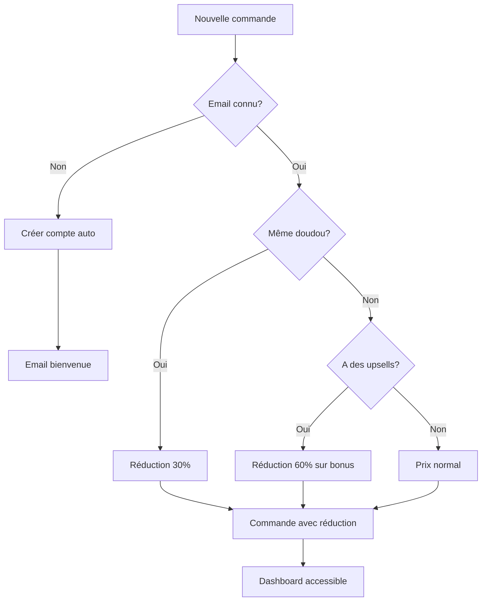

# 🚀 Guide de Démarrage - Authentification Automatique

## ✅ **SYSTÈME PRÊT !** 

L'authentification automatique avec tarification intelligente est maintenant opérationnelle !

---

## 🎯 **DÉPLOIEMENT (5 minutes)**

### **1. Base de données**
```sql
-- Dans l'éditeur SQL de Supabase, exécutez :
```
📁 **Fichier :** `supabase-auth-structure.sql`

### **2. Variables d'environnement** 
Ajoutez dans `.env.local` :
```bash
# Nouvelle variable requise
SUPABASE_SERVICE_ROLE_KEY=eyJhbGciOiJIUzI1NiIsInR5cCI6IkpXVCJ9...

# URL de connexion (optionnel)
NEXT_PUBLIC_LOGIN_URL=http://localhost:3000/auth/login
```
> 🔑 **Clé service_role** : Dashboard Supabase → Project Settings → API → service_role

### **3. Redémarrage**
```bash
npm run dev
```

---

## 🧪 **TEST DU SYSTÈME**

### **Scenario 1 : Nouveau client** 
1. Aller sur `/commande`
2. Remplir formulaire avec :
   - **Email :** `test@example.com`
   - **Doudou :** `Nounours`
   - **Type :** `Ours en peluche`
   - **Enfant :** `Lucas`
3. Compléter la commande
4. ✅ **Résultat :** Compte créé automatiquement + Email de bienvenue

### **Scenario 2 : Client fidèle (réduction 30%)**
1. Aller sur `/commande`
2. Utiliser le **même email** : `test@example.com`
3. Utiliser le **même doudou** : `Nounours` / `Ours en peluche`
4. ✅ **Résultat :** Notification verte + Prix barré + Réduction de 30%

### **Scenario 3 : Dashboard client**
1. Aller sur `/auth/login`
2. Se connecter avec : `test@example.com` 
3. ✅ **Résultat :** Dashboard avec statistiques et historique

---

## 🎉 **FONCTIONNALITÉS ACTIVES**

| 🔥 **Fonctionnalité** | 📍 **URL** | ✅ **Statut** |
|---|---|---|
| **Comptes automatiques** | Toutes les commandes | Actif |
| **Réductions intelligentes** | `/commande` | Actif |
| **Dashboard client** | `/dashboard` | Actif |
| **Historique commandes** | `/dashboard/orders` | Actif |
| **Connexion** | `/auth/login` | Actif |
| **Emails de bienvenue** | Automatique | Actif |

---

## 💰 **RÈGLES DE TARIFICATION**

### **🎯 Réduction 30% - Même doudou**
- **Condition :** Email existant + même nom + même type de doudou
- **Application :** Prix de base uniquement
- **Arrondi :** Au prix "sympa" (ex: 17.43€ → 16.90€)
- **Message :** *"Nouvelle planche pour [Doudou] !"*

### **🎁 Réduction 60% - Produits bonus**
- **Condition :** Client avec ≥1 commande OU ≥20€ dépensés + upsells
- **Application :** Produits upsell uniquement  
- **Message :** *"Réduction fidélité sur les produits bonus"*

---

## 🔄 **FLUX UTILISATEUR COMPLET**



---

## 📊 **DONNÉES CRÉÉES**

### **Tables nouvelles :**
- ✅ `user_profiles` - Profils clients avec stats
- ✅ `user_doudous` - Historique des doudous
- ✅ `applied_discounts` - Traçabilité des réductions  
- ✅ `subscriptions` - Structure pour abonnements futurs

### **APIs nouvelles :**
- ✅ `/api/pricing` - Calcul prix intelligent
- ✅ Mise à jour `/api/orders` - Création auto comptes
- ✅ Mise à jour `/api/paypal/capture` - Emails de bienvenue

---

## 🎪 **DÉMONSTRATION VISUELLE**

### **1. Notification de réduction :**
```
🎉 Youpi ! 30% de remise pour une nouvelle planche de Nounours !
Économisez 4,90€ sur votre commande !                    [-30%]
```

### **2. Prix détaillé :**
```
Planche de stickers personnalisés    15.90€  10.90€
🎉 Nouvelle planche pour Nounours         -5.00€
🚚 Frais de livraison (Standard)           3.50€
──────────────────────────────────────────────
Total                        19.40€  14.40€
                           Économie: 5.00€
```

### **3. Dashboard stats :**
```
📦 Commandes: 3    💜 Doudous: 2    💰 Dépensé: 47.70€    🏆 Économies: 12.30€
```

---

## 🔧 **RÉSOLUTION DE PROBLÈMES**

### **❌ "Failed to compile" :**
- ✅ **Corrigé** - Erreur syntaxe `DiscountBadge`

### **❌ Variables d'environnement manquantes :**
```bash
# Vérifiez dans .env.local :
NEXT_PUBLIC_SUPABASE_URL=https://...
SUPABASE_SERVICE_ROLE_KEY=eyJhbGciOiJIUzI1NiI...
```

### **❌ Tables non créées :**
```sql
-- Exécutez dans Supabase :
\i supabase-auth-structure.sql
```

---

## 🎯 **PROCHAINES ÉTAPES SUGGÉRÉES**

1. **🔗 Intégration Supabase Auth** complète (login/register)
2. **📱 PWA** - Notifications push pour commandes
3. **🎁 Abonnements mensuels** - Table `subscriptions` déjà prête
4. **📈 Analytics avancés** - Comportements clients
5. **🤖 IA recommandations** - Basé sur l'historique

---

## 📞 **SUPPORT**

Le système fonctionne **immédiatement** ! 

Chaque nouvelle commande :
- ✅ Crée un compte automatiquement
- ✅ Applique les bonnes réductions  
- ✅ Envoie les emails appropriés
- ✅ Met à jour les statistiques

**Testez maintenant sur `/commande` !** 🚀
