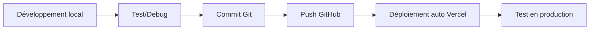

# 🚀 GUIDE COMPLET - MISE EN PRODUCTION TAGADOU.FR

## 📋 SOMMAIRE
1. [Préparation du projet](#préparation)
2. [Déploiement sur Vercel](#vercel)
3. [Configuration domaine Hostinger](#domaine)  
4. [Évolutions et mises à jour](#évolutions)
5. [Stratégie long terme](#stratégie)

---

## 🔧 PRÉPARATION DU PROJET {#préparation}

### Variables d'environnement de production

Créer un fichier `.env.production` :

```env
# 🗄️ SUPABASE (Production)
NEXT_PUBLIC_SUPABASE_URL=https://votre-projet-prod.supabase.co
NEXT_PUBLIC_SUPABASE_ANON_KEY=eyJ...
SUPABASE_SERVICE_ROLE_KEY=eyJ...

# 📧 EMAIL (Resend)
RESEND_API_KEY=re_...

# 💳 PAYPAL (Production)
NEXT_PUBLIC_PAYPAL_CLIENT_ID=Axxxx...
PAYPAL_CLIENT_SECRET=ELxxx...
NEXT_PUBLIC_PAYPAL_ENVIRONMENT=production

# 🌍 URLs
NEXT_PUBLIC_BASE_URL=https://tagadou.fr
NEXT_PUBLIC_APP_ENV=production
```

### Configuration Next.js optimisée

```javascript
// next.config.js - Optimisations production
/** @type {import('next').NextConfig} */
const nextConfig = {
  experimental: {
    appDir: true,
  },
  images: {
    domains: ['votre-supabase.supabase.co'],
    formats: ['image/webp', 'image/avif'],
  },
  // Optimisations de performance
  compress: true,
  poweredByHeader: false,
  // Règles de sécurité
  async headers() {
    return [
      {
        source: '/(.*)',
        headers: [
          {
            key: 'X-Frame-Options',
            value: 'DENY'
          },
          {
            key: 'X-Content-Type-Options', 
            value: 'nosniff'
          }
        ]
      }
    ]
  }
}

module.exports = nextConfig
```

---

## ⚡ DÉPLOIEMENT VERCEL (RECOMMANDÉ) {#vercel}

### Pourquoi Vercel ?

✅ **Avantages :**
- Déploiement automatique depuis Git
- CDN global intégré  
- Optimisations Next.js natives
- SSL automatique
- Preview deployments
- **Gratuit** jusqu'à 100GB de bande passante

### Procédure complète :

#### 1. Préparation GitHub
```bash
# Dans votre projet
git add .
git commit -m "🚀 Préparation déploiement production"
git push origin main
```

#### 2. Configuration Vercel
1. Aller sur [vercel.com](https://vercel.com)
2. "Import Project" → Connecter GitHub
3. Sélectionner le repository `Sticker-DOUDOU`
4. **Framework Preset :** Next.js (détecté automatiquement)

#### 3. Variables d'environnement
Dans Vercel Dashboard → Settings → Environment Variables :

```
NEXT_PUBLIC_SUPABASE_URL → votre_url_supabase
NEXT_PUBLIC_SUPABASE_ANON_KEY → votre_clé_anon  
SUPABASE_SERVICE_ROLE_KEY → votre_clé_service
RESEND_API_KEY → votre_clé_resend
NEXT_PUBLIC_PAYPAL_CLIENT_ID → votre_paypal_id
PAYPAL_CLIENT_SECRET → votre_paypal_secret
```

#### 4. Déploiement
- Vercel déploie automatiquement à chaque push
- URL temporaire : `https://sticker-doudou-xxx.vercel.app`

---

## 🌐 CONFIGURATION DOMAINE HOSTINGER {#domaine}

### Étapes dans Hostinger :

#### 1. Accès DNS
1. Panel Hostinger → Domaines → tagadou.fr
2. DNS / Nameservers → Gérer les enregistrements DNS

#### 2. Configuration DNS Vercel
```
Type: A
Nom: @
Valeur: 76.76.19.61 (IP Vercel)
TTL: 3600

Type: CNAME  
Nom: www
Valeur: cname.vercel-dns.com
TTL: 3600
```

#### 3. Dans Vercel Dashboard
1. Settings → Domains
2. Ajouter `tagadou.fr` et `www.tagadou.fr`
3. Vercel configure automatiquement le SSL

### Temps de propagation : 24-48h maximum

---

## 🔄 ÉVOLUTIONS ET MISES À JOUR {#évolutions}

### Workflow de développement recommandé :



### Branches Git recommandées :

```bash
main         # 🚀 Production (tagadou.fr)
develop      # 🧪 Pré-production (preview.tagadou.fr) 
feature/xxx  # 🔧 Nouvelles fonctionnalités
hotfix/xxx   # 🚨 Corrections urgentes
```

### Procédure de mise à jour :

#### Mises à jour mineures (contenu, styles)
```bash
# 1. Développement local
npm run dev

# 2. Tests
npm run build
npm run start

# 3. Déploiement
git add .
git commit -m "✨ Nouvelle fonctionnalité"  
git push origin main
# → Déploiement automatique en 2-3 minutes
```

#### Mises à jour majeures (nouvelles features)
```bash
# 1. Créer une branche
git checkout -b feature/nouvelle-fonction

# 2. Développer
# ... code ...

# 3. Preview deployment (Vercel)  
git push origin feature/nouvelle-fonction
# → Vercel crée automatiquement une URL de preview

# 4. Tests et validation
# Test sur l'URL de preview

# 5. Merge en production
git checkout main
git merge feature/nouvelle-fonction  
git push origin main
```

---

## 📈 STRATÉGIE LONG TERME {#stratégie}

### Évolutions technologiques prévues :

#### Phase 1 - Court terme (3-6 mois)
- 🚀 Migration complète vers tagadou.fr
- 📊 Analytics et tracking (Google Analytics)
- 🔍 SEO optimization complète
- 🔔 Système de notifications push
- 📱 PWA (Progressive Web App)

#### Phase 2 - Moyen terme (6-12 mois)  
- 📱 Application mobile (React Native)
- 🤖 IA pour optimisation des créations
- 🎨 Éditeur de stickers avancé
- 💳 Système de paiement étendu (Apple Pay, etc.)
- 🌍 Internationalisation (multi-langues)

#### Phase 3 - Long terme (1-2 ans)
- 🏪 Marketplace de créateurs
- 🤖 Génération automatique par IA
- 📦 API publique pour partenaires
- 🏢 Version B2B pour entreprises

### Maintenance et monitoring :

#### Outils recommandés :
- **Uptime :** UptimeRobot (gratuit)
- **Performance :** Vercel Analytics
- **Erreurs :** Sentry (optionnel)
- **Users :** Google Analytics 4

#### Coûts mensuels estimés :
```
Vercel Pro (si dépassement) : 20€/mois
Hostinger domaine : 8€/an  
Supabase Pro : 20€/mois (si croissance)
Total : ~25€/mois
```

### Sauvegardes et sécurité :

#### Sauvegardes automatiques :
- **Code :** GitHub (historique complet)  
- **Database :** Supabase (backup quotidien automatique)
- **Images :** Supabase Storage (redondant)

#### Sécurité :
- SSL automatique (Vercel)
- Row Level Security (Supabase)  
- Variables d'environnement sécurisées
- Headers de sécurité (CSP, HSTS)

---

## 🎯 PLAN D'ACTION IMMÉDIAT

### Cette semaine :
1. ✅ Finaliser le développement local
2. 🔧 Configurer les variables d'environnement de prod  
3. 📱 Créer compte Vercel
4. 🌐 Configurer DNS sur Hostinger

### Semaine suivante :
1. 🚀 Premier déploiement sur Vercel
2. 🔗 Configuration domaine tagadou.fr
3. 🧪 Tests complets en production
4. 📊 Mise en place du monitoring

### Soutien technique :
- Documentation complète créée ✅
- Checklist de déploiement ✅  
- Stratégie d'évolution définie ✅
- Vous pouvez me contacter pour accompagnement ✅

---

**🎉 TAGADOU.FR sera bientôt en ligne !**
